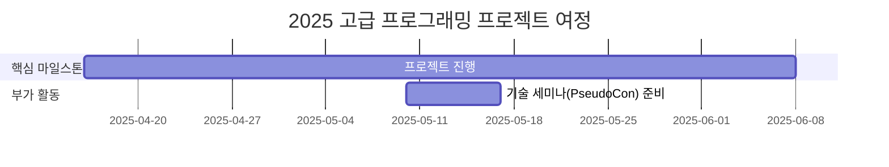

# 2025_Advanced_Programming

<h1 align="center"> 팀 이름 or 프로젝트 이름 </h1>

 

<!-- sheilds: https://shields.io/ -->
<!-- hits badge: https://hits.seeyoufarm.com/ -->

> Welcome to  Generative AI in Drug Design Lab repository! ( 팀 소개 )We aim to organize recent papers related with generative AI in drug discovery, We are planning to offer tools and frameworks for generating molecules, benchmark, and visualized analysis. Join us in advancing the field of generative AI through open collaboration and innovation!

## 🌟 프로젝트 목표 (Project Vision)
_"(실현하고 싶은 가치?) ex) 이론에서 실전까지, 함께 성장하는 AI 실험실"_
- 아래 예시 참고
- Drug Design에 활용되는 Generative Model 에 대한 스터디 및 프로젝트
- 개인 성장과 집단 지혜의 시너지 창출
- 오픈소스 정신을 바탕으로 한 지식 공유 문화
- 실패를 성공의 디딤돌로 만드는 실험적 접근

## 🧑 팀 소개 (Team)

| 역할          | 이름 |  기술 스택 배지                                                                 | 주요 관심 분야                          |
|---------------|------|-----------------------------------------------------------------------|----------------------------------------|
| **Member** | [서호영]( ) |  | |
| **Member** | [김예준](https://www.linkedin.com/in/ye-jun-kim-yerdy) |  | 생성형 AI |
| **Member** | [이해인]( ) |  |  |
| **Member** | [김현민]( ) |  |  |

## 🚀 프로젝트 로드맵 (Project Roadmap)

## 💻 주차별 활동 (Activity History)

| 날짜 | 내용 | 발표자 | 발표자료 |
| -------- | -------- | ---- | --- | 
| 2025/04/30 | - | - |  - |
| 2025/05/07 | - | - |  - |
| 2025/05/14 | - | - |  - |
| 2025/05/21 | - | - |  - |
| 2025/05/28 | - |  - | - |
| 2025/06/04 | -|  - | - |
| 2025/06/11 |- |  - | -|
| 2025/06/18 | - |  - |  - |

<h2>Contributors 😃</h2>

  

<h2>License 🗞</h2>

This project is licensed under the [MIT License](https://opensource.org/licenses/MIT).
