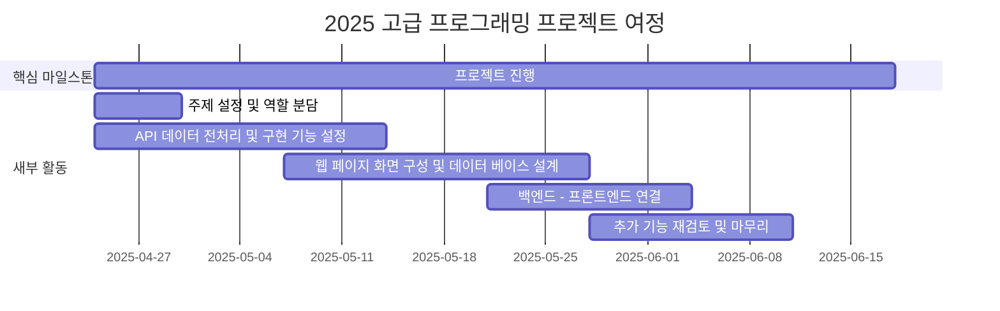

# 2025_Advanced_Programming

<h1 align="center"> Spec-Trackr </h1>

<div align="center">
<a href="https://github.com/khyeonm/2025_Advanced_Programming/stargazers"></a>
<a href="https://github.com/khyeonm/2025_Advanced_Programming/network/members"></a>
<a href="https://github.com/khyeonm/2025_Advanced_Programming/pulls"></a>
<a href="https://github.com/khyeonm/2025_Advanced_Programming/discussions"></a>
<a href="https://github.com/khyeonm/2025_Advanced_Programming/graphs/contributors"></a>
</div>
<br>

<!-- sheilds: https://shields.io/ -->
<!-- hits badge: https://hits.seeyoufarm.com/ -->

우리는 의생명융합공학부 학생들의 진로 탐색을 돕기 위해 모였습니다.
다양한 분야로의 진출 가능성을 연결하고, 채용 정보와 직무별 필수 역량을 한눈에 볼 수 있도록 지원하는 플랫폼을 만들고 있습니다.
직무 정보 통합, 스펙 사례 제공, 맞춤형 탐색 기능을 통해 학생들이 자신만의 길을 준비할 수 있도록 함께합니다.
열린 협업과 혁신을 통해 모두의 가능성을 넓혀갑니다!


## 🌟 프로젝트 배경 (Project Background)
_"의생명융합공학부 학생들의 진로 고민, 우리가 돕겠습니다."_
- 의생명융합공학부 학생들은 다양한 분야를 학습했지만, 진로 선택과 준비에 막막함을 느끼고 있음
- 데이터 분석, 인공지능, 의료공학 등 폭넓은 진출 가능성에도 불구하고, 구체적인 직무/산업 정보 탐색에 어려움 존재
- 채용 정보가 링크드인, 원티드, 사람인 등 여러 사이트에 흩어져 있어 비교·분석이 번거로움
- 각 직무별로 필수적으로 요구되는 공통 역량이 존재하지만, 이를 체계적으로 파악할 수 있는 지원 체계 부족
- 의생명융합공학부 고학년 학생들이 직접 겪은 진로 정보 부족 문제를 해결하고자 플랫폼 기획

## 🌟 프로젝트 목표 (Project Vision)
_"폭넓은 가능성 속에서, 각자의 길을 찾고 준비할 수 있도록 함께합니다."_
- 의생명융합공학부 학생 맞춤형 직무/산업 정보 제공
- 다양한 취업 사이트의 채용공고 통합 제공
- 직무별 공통 필수 역량 도출 및 시각화
- 실제 합격자 자소서, 스펙 사례 기반 현실적 준비 방법 제시
- 관심 직무 기반 맞춤형 정보 탐색 기능 제공

## 🧩 주요 기능 (Key Features)
### 🖥️ 프론트엔드 기능
[프론트엔드 README](./frontend/README.md)

### 🛠️ 백엔드 기능
[백엔드 README](./backend/README.md)

## 🧰 기술 스택
| 구분      | 기술                  |
|-----------|-----------------------|
| Backend   | Swagger, FastAPI      |
| Frontend  | React, Tableau        |
| DB        | PostgreSQL            |
| DevOps    | GitHub, Docker        |

## 🚀 사용자 가이드
```bash
# 2025_Advanced_Programming 디렉토리에서 아래 명령어 실행
docker compose up
# 브라우저에서 아래 URL 접속
http://localhost:3002
```
### 💡 문제 해결
브라우저에 접속 시 화면이 뜨지 않는 경우
- VSCode의 Ports에 3002를 추가한 후 URL 재접속

## 🧑 팀 소개 (Team)

| 역할          | 이름 |  기술 스택 배지                         |                           
|---------------|------|---------------------------------------------------------------------------------------------------------------|
| **백엔드** | [서호영]( ) |   |
| **프론트엔드** | [김예준](https://www.linkedin.com/in/ye-jun-kim-yerdy) |   |
| **백엔드** | [이해인]( ) |    |
| **프론트엔드** | [김현민]( ) |    |


## 🚀 프로젝트 로드맵 (Project Roadmap)


## 💻 주차별 활동 (Activity History)

| 날짜 | 내용 | 발표자 | 발표자료 |
| -------- | -------- | ---- | --- | 
| 2025/04/30 | 프로젝트 소개 | 서호영 | [25/04/30](https://pusanackr-my.sharepoint.com/:p:/g/personal/haein1012_pusan_ac_kr/EaLw18OsvHxErTauA2G-gqMBW8-u26Zwrk3SYRkAFCfdXQ?e=Tsu63M)|
| 2025/05/07 | 2주차  | 김현민 |  [25/05/07](https://pusanackr-my.sharepoint.com/:p:/g/personal/haein1012_pusan_ac_kr/Ea4hJRmxTi5DgY5dMcaGs3QBbcgjHheu53vweCHI4rydRQ) |
| 2025/05/14 | - | - |  - |
| 2025/05/21 | - | - | -  |
| 2025/05/28 | 3-5주차 | 김예준 | [25/05/28](https://pusanackr-my.sharepoint.com/:p:/g/personal/haein1012_pusan_ac_kr/EeO-PUyPaddDrsQ9LwEOr8cBUkAVRRCymfRxqk8n6lNB0Q?e=IcFPFO) |
| 2025/06/04 | 6주차 | 이해인 | [25/06/04](https://pusanackr-my.sharepoint.com/:p:/g/personal/haein1012_pusan_ac_kr/Ebd1e-u86-hMo0Rop_Lx58sBEUq8yqvExVrlr6g5aHqFhQ?e=wL39gb) |
| 2025/06/11 |- |  - | -|


<h2>Contributors 😃</h2>
<a href="https://github.com/khyeonm/2025_Advanced_Programming/graphs/contributors">
  
</a>
<br><br>

<h2>License 🗞</h2>

This project is licensed under the [MIT License](https://opensource.org/licenses/MIT).
